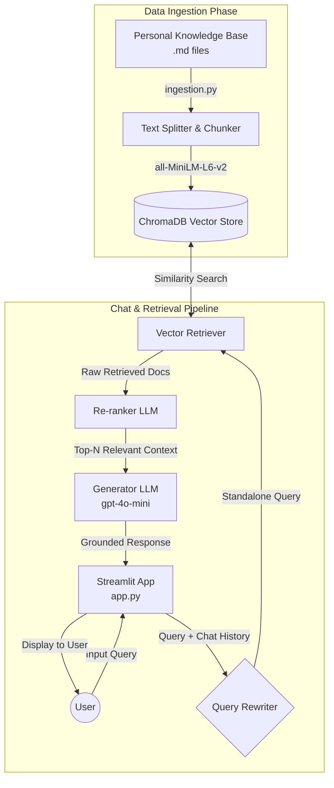

<div align="center">
  
  <h1 align="center">AnchorAI</h1>
  <p align="center">
    <strong>A highly intuitive Retrieval-Augmented Generation (RAG) system that securely grounds every conversation directly in your personal knowledge base.</strong>
    <br />
    <br />
    <a href="https://github.com/jarvis37/AnchorAI/issues">Report Bug</a>
    ·
    <a href="https://github.com/jarvis37/AnchorAI/issues">Request Feature</a>
  </p>
  
  <p align="center">
    
    
    
    
    
  </p>
</div>

---

## 🚀 Overview

**AnchorAI** is a memory-augmented chat interface that transforms your static markdown notes into an interactive, intelligent assistant. By employing advanced Retrieval-Augmented Generation (RAG) techniques—including query rewriting and context re-ranking—AnchorAI ensures that the answers you get are highly accurate, contextual, and grounded purely in your own data.

<div align="center">
  
  <br>
  <em>(Experience liftoff with your next-generation assistant)</em>
</div>

## ✨ Key Features

- **🧠 Semantic Ingestion**: Intelligently parses and chunks your custom Markdown (`.md`) notes based on semantic similarity using highly efficient Hugging Face embeddings (`all-MiniLM-L6-v2`).
- **🔍 Advanced RAG Pipeline**: Retrieves highly relevant context from your vector database to synthesize accurate, hallucination-free answers.
- **🔄 Smart Query Rewriting**: Maintains conversational memory. It automatically refines and rewrites follow-up questions to be explicit and standalone based on chat history.
- **⚖️ Context Re-ranking**: Employs an LLM to dynamically re-rank retrieved documents, ensuring only the highest-value information is passed as context for answer generation.
- **💬 Interactive UI**: A clean, responsive, and modern chat interface built with Streamlit, designed for maximum ease of use.
- **🔌 Flexible Backend**: Built on LangChain and designed to integrate seamlessly with the standard OpenAI API.

## 🏗️ System Architecture & Workflow

AnchorAI operates in two primary phases: **Data Ingestion** and **Retrieval & Generation**. 

### Architecture Flowchart



### How it works:
1. **Data Ingestion**: Your personal notes in the `Transformers/` (or `Knowledge_Base/`) folder are processed. The text is chunked and embedded via HuggingFace's MiniLM model, then stored locally in ChromaDB.
2. **Conversation & Memory**: When you ask a question, AnchorAI evaluates the active chat history. If necessary, it rewrites your prompt into a distinct, standalone query so context isn't lost.
3. **Retrieval & Re-ranking**: The standalone query searches ChromaDB for the closest matches. Because vector similarity search isn't always perfect, an LLM acts as a "judge" to score and re-rank the retrieved chunks based on their direct relevance to the question.
4. **Answer Generation**: The top-ranked contexts are synthesized into a final prompt, and the OpenAI model (`gpt-4o-mini`) generates the precise, grounded answer.

## 📁 Project Structure

```text
AnchorAI/
├── app.py              # Main application entry point & Streamlit frontend
├── ingestion.py        # Script to process markdown files & populate vector db
├── retrieval.py        # Core RAG logic: vector querying, re-ranking, & rewriting
├── requirements.txt    # Project dependencies
├── Transformers/       # 📂 Directory containing your source Markdown notes (or Knowledge_Base)
└── chroma_db/          # 🗄️ Local Chroma vector database directory (auto-generated)
```

## 🛠️ Installation & Setup

### Prerequisites
- Python 3.8+
- An [OpenAI API Key](https://platform.openai.com/)

### 1. Clone the repository
```bash
git clone https://github.com/jarvis37/AnchorAI.git
cd AnchorAI
```

### 2. Set up a Virtual Environment (Recommended)
```bash
python -m venv venv
# On Windows
venv\Scripts\activate
# On macOS/Linux
source venv/bin/activate
```

### 3. Install Dependencies
```bash
pip install -r requirements.txt
```

### 4. Configure Environment Variables
Set your OpenAI API key in your terminal or create a `.env` file in the root directory:
```bash
# Linux/macOS
export OPENAI_API_KEY="your-api-key-here"

# Windows (Command Prompt)
set OPENAI_API_KEY="your-api-key-here"
```

## 🚀 Usage Guide

### Step 1: Prepare Your Data
Place all your markdown notes (`.md` files) inside the `Transformers/` (or designated `Knowledge_Base/`) directory.

### Step 2: Ingest the Notes
Run the ingestion script to process the text and generate your vector embeddings. This might take a moment depending on the volume of your notes.
```bash
python ingestion.py
```
*(This will automatically create and populate the `chroma_db/` directory).*

### Step 3: Start the Application
Launch the Streamlit interface:
```bash
python -m streamlit run app.py
```
Open your browser and navigate to `http://localhost:8501`. You are now ready to chat seamlessly with your data!

## ⚙️ Configuration

You can customize the behavior of AnchorAI by modifying the variables in the code:
- **LLM Model**: Defaults to `gpt-4o-mini`. You can update this inside `app.py` and `retrieval.py` based on your OpenAI plan or preferences.
- **Embeddings**: Utilizes `sentence-transformers/all-MiniLM-L6-v2` locally to ensure privacy, save API costs, and generate vectors blazingly fast.
- **Persistent Storage**: Data is saved locally to `./chroma_db`. To wipe the database or start fresh, simply delete this directory and run `ingestion.py` again.

## 💻 Tech Stack

- **[LangChain](https://www.langchain.com/)**: Orchestration and RAG pipeline components.
- **[ChromaDB](https://www.trychroma.com/)**: High-performance local vector database.
- **[Hugging Face](https://huggingface.co/)**: Local sentence embeddings (`all-MiniLM-L6-v2`).
- **[Streamlit](https://streamlit.io/)**: Fast, interactive front-end framework.
- **[OpenAI API](https://openai.com/)**: Industry-leading LLM intelligence.

---
<div align="center">
  <em>If you find AnchorAI helpful, please consider leaving a ⭐ on the repository!</em>
</div>
